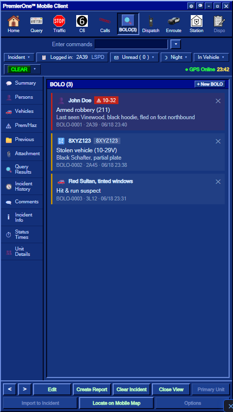
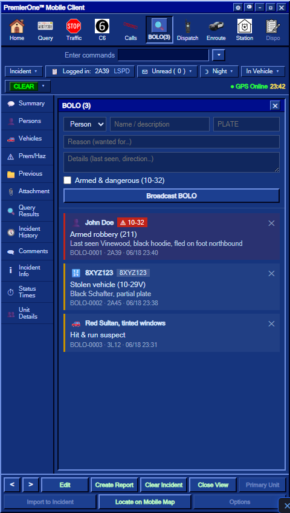

# BOLO

A **BOLO** is a server-wide alert that tells every officer to watch for a specific **person, vehicle or plate**. Create one from the MDT and it's broadcast to all on-duty law enforcement — and it pops up automatically the next time anyone runs that name or plate.

> 📑 **Related:** [Using the MDT](/user-guide/mdt) · [Query: People & Plates](/user-guide/mdt-query) · [Dispatch console](/user-guide/dispatch-console)

---

## 🔍 Opening the BOLO board

The **BOLO** tab sits in the MDT toolbar (Law Enforcement only). The tab shows a live count of active BOLOs, e.g. `BOLO (3)`.

```
[Home] [Query] [Traffic] [Code 6] [Calls] [🔍 BOLO (3)] [Dispatch] …
```



---

## ➕ Creating a BOLO

Click **+ New BOLO** and fill in the form:

| Field | What it's for |
|-------|----------------|
| **Type** | `Person`, `Vehicle` or `Plate` |
| **Name / description** | Subject name, or a vehicle description ("black Schafter, tinted windows") |
| **Plate** | The plate to watch for (used for auto-hits on plate runs) |
| **Reason** | Why they're wanted — "Armed robbery 211", "Stolen vehicle 10-29V" |
| **Details** | Last seen, direction of travel, anything else |
| **Armed & dangerous (10-32)** | Flags the BOLO red and adds a `10-32` warning everywhere it shows |

Press **Broadcast BOLO**. Every on-duty officer hears an alert tone and gets an on-screen notification with the subject (and a red **10-32** tag if it's flagged dangerous).



---

## 🎯 Automatic hits

This is the part that makes BOLOs useful: you don't have to remember them.

- When anyone **runs a person** whose name matches an active BOLO, the person card shows a bright **ACTIVE BOLO** banner.
- When anyone **runs a plate** that matches a BOLO (directly, or a vehicle registered to the person), the same banner appears.
- Dangerous (10-32) hits are shown in **red**.

```
┌─────────────────────────────────────────────┐
│ John Doe                         [WARRANT]  │
│ 🔍 ACTIVE BOLO — Armed robbery 211 · ⚠ 10-32│
│ DOB: 1990-04-12 · Male                      │
│ …                                           │
└─────────────────────────────────────────────┘
```

See [Query: People & Plates](/user-guide/mdt-query) for how runs work.

---

## 🗂 Managing BOLOs

- Every BOLO shows its **ID** (`BOLO-0007`), who created it and when.
- Press the **✕** on a card to **cancel** it.
- BOLOs **expire automatically after 24 hours** so the board doesn't fill with stale alerts.
- The board survives a server restart — active BOLOs are saved.

---

## Good to know

- Creating and cancelling BOLOs is logged for staff (admin audit) and posted to the dispatch log.
- A BOLO with **no plate** only auto-hits on **person** runs; add a plate to also catch vehicle/plate runs.
- BOLOs are shared across the whole department — anyone can create or cancel them, so keep them accurate and cancel them when they're resolved.

