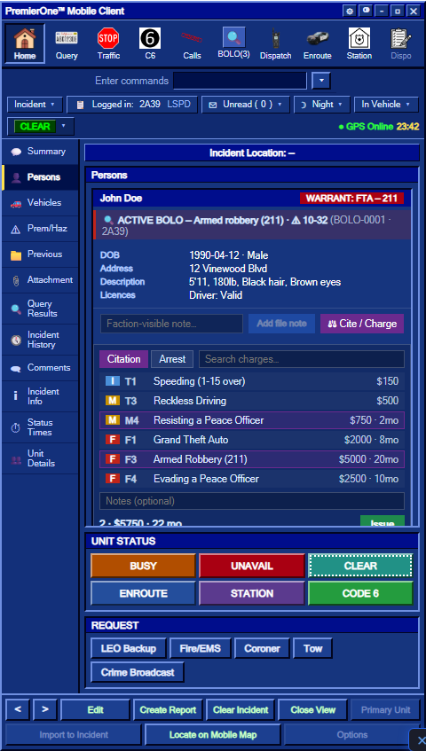

# Citations & Charges

Write a **citation** (ticket) or an **arrest report** against a person. Pick charges from the server's **penal code**, and the system adds up the **fine** and **jail time** for you and files it to the subject's record.

> 📑 **Related:** [Query: People & Plates](/user-guide/mdt-query) · [Using the MDT](/user-guide/mdt) · [LASD CAD](/user-guide/lasd-cad)

---

## 🚪 Two ways in

Every terminal reaches the same picker and files the same record — pick whichever fits what you are doing.

| Where | How to open it | The subject is… |
|-------|----------------|-----------------|
| **Person record card** (LAPD MDT, Agency MDT) | Run the person, then **⚖ Cite / Charge** on their card | …the person on the card — nothing to type |
| **Charges tab** (LAPD MDT) | **⚖ Charges** in the toolbar | …typed into the **Target** field |
| **CITE / CHARGE** (Agency MDT) | The button in the function bar | …typed into the **Target** field |
| **CITE / CHARGE** (LASD PCMS, 9100-T) | From an open person record | …the person you last ran |

The record-card route is the quickest during a stop you already ran. The **Charges tab** exists for the other case — you know the name and do not need the whole record, e.g. writing up a citation after the fact.

> ℹ️ **The Target must be the character's exact name.** The server matches on it and refuses anything ambiguous, so `John` will not find *John Fitzgerald*. If you queried the person just before, hit **From last query** to fill it in with one click.

---

## ⚖ Issuing charges

1. **Pick your subject** — either open their record card, or open the **Charges** tab and fill in **Target**.
2. On a record card, click **⚖ Cite / Charge**. In the Charges tab you are already there.
3. Choose the report type: **Citation** (ticket / fine) or **Arrest** (booking + jail time).
4. **Search and pick charges** from the penal code list. Each charge shows its class:

   | Badge | Class | Meaning |
   |:----:|-------|---------|
   | 🟦 `I` | Infraction | Minor — fine only |
   | 🟨 `M` | Misdemeanor | Mid-level — fine, sometimes short jail |
   | 🟥 `F` | Felony | Serious — high fine + jail time |

5. The footer shows a **live total**: number of charges, total **fine** and total **jail** (months).
6. Add optional **notes**, then press **Issue**.

```
┌──────────────────────────────────────────────┐
│ [Citation] [Arrest]      [Search charges… ]  │
│ ──────────────────────────────────────────── │
│ 🟦 T1  Speeding (1-15 over)          $150     │
│ 🟥 F3  Armed Robbery (211)    $5000 · 20mo  ✓ │
│ 🟨 M4  Resisting a Peace Officer $750 · 2mo ✓ │
│ ──────────────────────────────────────────── │
│ Notes: …                                      │
│ 2 · $5750 · 22 mo                  [ Issue ]  │
└──────────────────────────────────────────────┘
```



The **Charges tab** is the same list on a full-width sheet, with the Target field and the type switch in the bar above it:

```
┌────────────────────────────────────────────────────────────────┐
│ CITE / CHARGE                                                  │
│ Target [ John Fitzgerald ] [From last query] [Citation][Arrest] │
│                                          [ Search charges…   ] │
│ ── CL ── Code ── Charge ─────────────────── Fine / Jail ────── │
│    🟥 F   101   Murder 1st Degree           $50000 · 240 mo  ✓ │
│    🟨 M   311   Petty Theft                 $800 · 4 mo        │
│    🟦 I   415   Disturbing the Peace        $250               │
│ ────────────────────────────────────────────────────────────── │
│ [ Notes (optional) ]        Selected: 1 · $50000 · 240 mo      │
│                                                     [ Issue ]  │
└────────────────────────────────────────────────────────────────┘
```

> 📸 **Screenshot pending** — this page still needs a capture of the Charges tab (LAPD) and of CITE / CHARGE (Agency). Drop them in `content/user-guide/images/` and link them here.

> 💡 A search only filters what you *see* — charges you already ticked stay selected and stay in the total, even while the search hides them. Clear the search box to see the full selection again.

---

## 📁 Where it goes

When you issue charges, the system:

- **Files a record** on the subject (a *Citation* or *Arrest Report*) listing every charge, the total fine and jail time, your callsign and the date.
- That record is **faction-visible**, so it shows up on the person whenever an officer runs them — in both the **MDT** and the **[LASD CAD](/user-guide/lasd-cad)**.
- **Notifies the subject** (if they're online) that they've been charged, with the total fine.
- Logs the action for staff (admin audit) and the dispatch log.

> ℹ️ The fine and jail totals are calculated **on the server** from the penal code — they can't be tampered with from the client.

---

## 🛠 For server owners

The penal code lives in a config file (`configs/cfg-charges-sh.lua`) and is fully editable: add/remove charges, set the **class** (`I`/`M`/`F`), **fine** (USD) and **jail** (months). Your changes appear in the charge picker automatically — no rebuild of the UI required.

```lua
{ code = "F3", title = "Armed Robbery (211)", class = "F", fine = 5000, jail = 20 },
```

