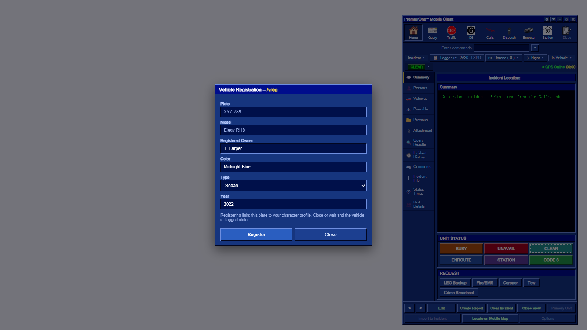
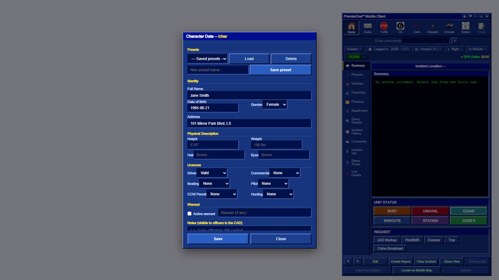
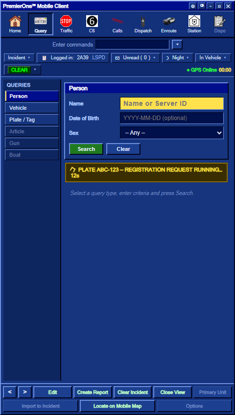

# Civilian & Vehicles

How the civilian side feeds the CAD: your character data, presets, vehicle
registration and what happens when an officer runs your plate.

## Your character sheet — `/char`
Run `/char` (or `/character`) to open your data sheet. Fill in things like:
- Full name (this becomes your **RP name / nick**)
- Address, date of birth
- Driver's licence status
- **Notes** — freeform RP info (e.g. gang affiliation) that officers see when they run you

**Saving** writes the record to the CAD *and* sets your session name, so you're
properly joined to the session. If you can't seem to join, it's because no name is set — `/char`, fill, save.

### Presets (unlimited, per identifier)
You can save **as many character presets as you like**; they're stored per your
identifier. Load one with a click to instantly switch characters, save the current
sheet as a new preset, or delete old ones — all from the character form.

## Registering a vehicle — `/vreg`
Sit in the vehicle you want to register and run `/vreg`. You can enter plate, make,
model, colour, owner and more. Registered vehicles then show up when an officer runs
the plate.

## When an officer runs your plate
1. An officer runs your plate (via `/run <plate>` or the MDT Query).
2. **If it's already registered**, your details come back in their MDT.
3. **If it's *not* registered** and you're the driver, you get a prompt:
   > *"An officer is running your plate. Enter your details within 15s or it will be flagged stolen."*
   - The `/vreg` form opens automatically.
   - The officer's MDT shows a **request-running timer** while you fill it in.
   - **Submit within 15 seconds** → the plate registers normally.
   - **Time out / close it** → the vehicle is **flagged stolen** in the CAD.

## Tips
- Keep your character notes current — they're a great RP hook for officers.
- Register your daily vehicles ahead of time so a routine plate-run doesn't turn into a "stolen" flag.
- Different characters = different presets; switch before you go out.

