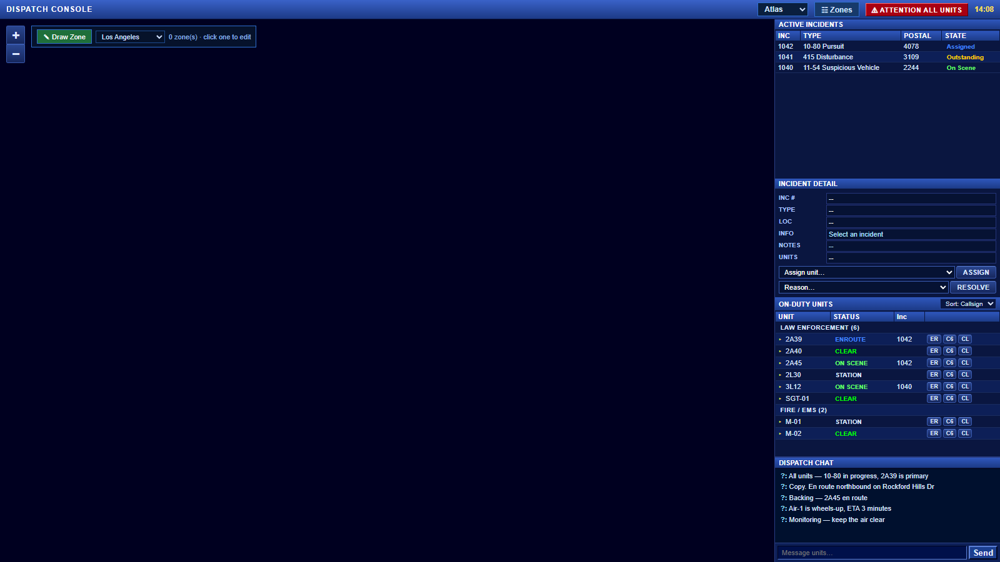
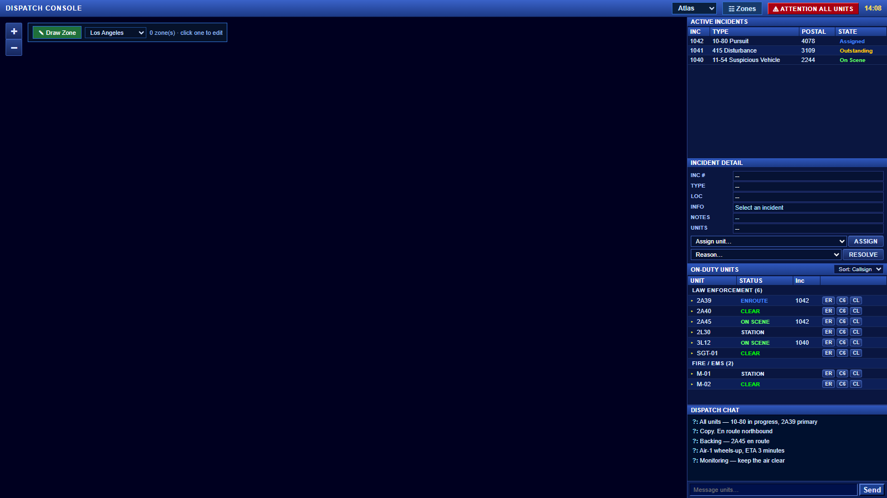
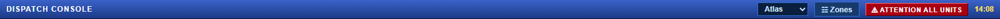
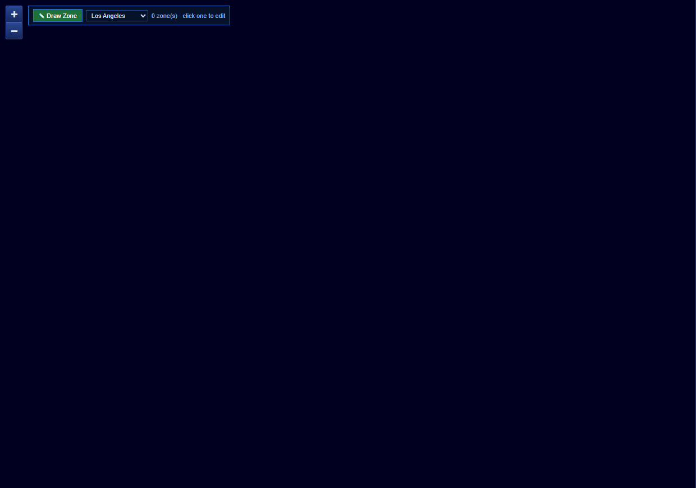
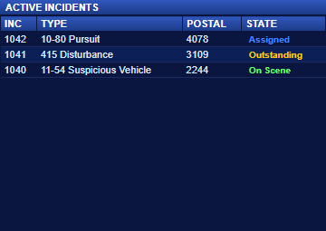
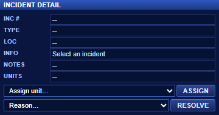
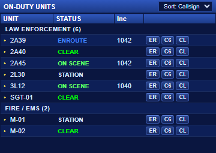
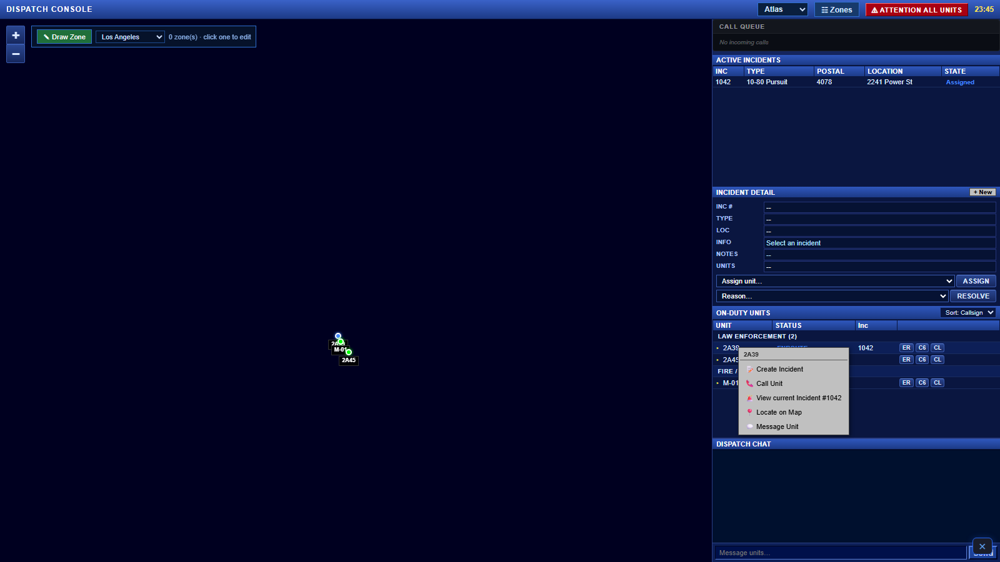
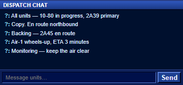
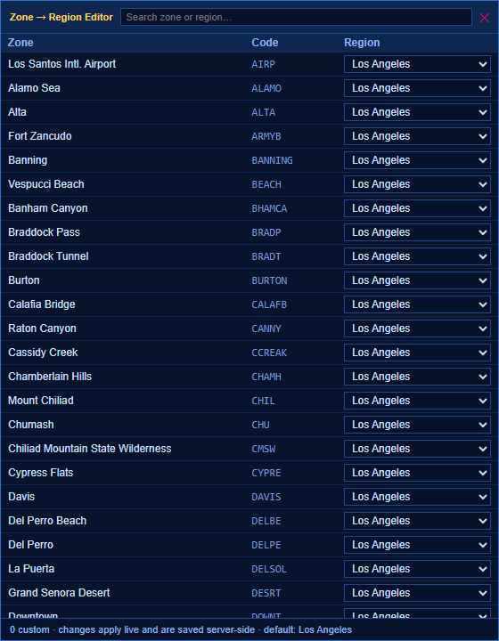

# Dispatch Console

A separate **full-screen CAD** for whoever is working **dispatch**. It's distinct from the in-car MDT and gives a live map of the area, every active incident, every on-duty unit, a chat channel between dispatch and units, and tools to manage zone boundaries that drive the region detection across the whole CAD.

> 📑 **Related:** [Using the MDT](/user-guide/mdt) · [Working with Incidents](/user-guide/mdt-incidents) · [Status labels](/support)

---

## 🟢 Going on dispatcher duty

You need to **opt in** before you can open the console:

```
/dispatch on        # go on dispatcher duty (you become "Operator XXXX")
/dispatch           # open / close the console
/dispatch off       # leave dispatcher duty (also closes the console)
```

Only on-duty **LEO / Fire / EMS / Coroner** can become dispatcher (devmode bypasses this for testing). When you go on duty, the server assigns you a random **Operator number** (e.g. `Operator 2147`) — that's the name your messages show under in the dispatch chat.

The console is **separate** from the MDT — when you open it, the MDT auto-closes (and vice-versa).




---

## 🗺 Layout at a glance

```
┌──────────────────────────────────────────────────────────────────────────────┐
│ DISPATCH CONSOLE     [Atlas ▾] [⛬ Zones] [⚠ ATTENTION ALL UNITS]   15:23     │  ← Top bar
├────────────────────────────────────────────┬─────────────────────────────────┤
│                                            │  ACTIVE INCIDENTS               │
│                                            │  INC   TYPE      POSTAL  STATE  │
│                                            │  20011 Code 6    9121   On Scene│
│                                            │  20010 Code 6    9121   On Scene│
│                ┌─────────┐                 │  …                              │
│           ⛬   │  Zone   │  ⛬              │  INCIDENT DETAIL                │
│       ⛬       │  layer  │      ⛬          │  INC# 20011                     │
│               └─────────┘                  │  TYPE: Code 6                   │
│                                            │  LOC:  9121 Innocence Blvd      │
│                  🚓 1A-12                  │  INFO: …                        │
│                                            │  [Assign unit ▾] [ASSIGN]       │
│                  📍 #20011                 │  [Reason ▾]      [RESOLVE]      │
│                                            │                                 │
│                                            │  ON-DUTY UNITS  [Sort: Callsign▾]│
│                                            │  ─ LAW ENFORCEMENT (3) ─        │
│                                            │  ▸ 1A-12   CODE SIX  20011      │
│                                            │  ▸ 1A-15   CLEAR                │
│                                            │  ─ FIRE / EMS (1) ─             │
│                                            │  ▸ M-7     ON SCENE  20007      │
│                                            │                                 │
│                                            │  DISPATCH CHAT  Operator 2147   │
│                                            │  [chat log scrolls here]        │
│                                            │  [Message units…] [Send]        │
└────────────────────────────────────────────┴─────────────────────────────────┘
```




---

## 🎛 Top bar




| Element | Purpose |
|---|---|
| **DISPATCH CONSOLE** | Title (the old "LOS ANGELES COUNTY" tag is gone in 3.0.4 — region is detected automatically now) |
| **Map Style dropdown** | Switch between **Atlas** (road map, default) · **Grid** (clean grid) · **Satellite** (real terrain). Live swap, no reload. The choice is remembered per client (`localStorage`). |
| **⛬ Zones button** | Open the **Zone Editor** (per-zone region overrides) — see [Zone Editor](#-zone-editor) below |
| **⚠ ATTENTION ALL UNITS** | Plays the alert tone (`3beep.ogg`) to **every on-duty LEO**, shows a "DISPATCH: Attention all units" notification, and logs the event |
| **Time** | Current in-game time |

> 💡 The map-style dropdown is also useful at night — Atlas reads better in dark interiors, Grid is the lightest, Satellite gives the most realistic terrain feel.

---

## 🗺 The map

A Leaflet map of the GTA world, fed by the **`lacore-maps`** resource (or your own CDN if you set `DispatchTileBase`).

### Markers




| Marker | What it is |
|---|---|
| 🔴 `911` | 911 Emergency call |
| 🟡 `311` | 311 Non-Emergency call |
| 🟣 `!` | Panic Button alert |
| 🔵 `TS` | Traffic Stop |
| ⚪ `INC` | Generic/manual incident |
| 🚓 `<callsign>` | A live on-duty unit (colored dot by status) |

Click a marker to **select** that incident or unit on the right sidebar.

### Zone polygons

If you've drawn any **region boundaries** (Zone Editor → Draw Zone), they show up as **coloured semi-transparent polygons** with the region name as a centered label. See the [Polygon Boundary Editor](#-polygon-boundary-editor) section below.

---

## 📋 Active Incidents (top right)

A live list of every non-resolved call in the CAD.




| Column | Meaning |
|---|---|
| **INC** | Incident number |
| **TYPE** | Traffic Stop / Code 6 / 911 / 311 / Panic / Crime Broadcast / … |
| **POSTAL** | Nearest postal code |
| **STATE** | Outstanding / Assigned / On Scene / Resolved |

Click a row to **select** the incident → the **Incident Detail** panel below updates and the map zooms / highlights the marker.

**Keyboard:** when no field is focused, **↑ / ↓** cycle the selected incident.

---

## 🔍 Incident Detail (mid-right)

Shows everything about the selected incident:




| Field | What it shows |
|---|---|
| **INC #** | Incident number |
| **TYPE** | Type label |
| **LOC** | Postal + street |
| **INFO** | Original message |
| **NOTES** | Disposition trail (filled in once resolved) |
| **UNITS** | Callsigns currently attached |

### Assign a unit

1. Pick a unit from **Assign unit…** (grouped by **LEO** / **Fire-EMS** / **Coroner**)
2. Click **ASSIGN**

The server:
- Sets that unit to **ENROUTE**
- Attaches them to the incident
- Pushes a notification to the unit
- Adds a comment to the incident: *"Assigned by dispatch — en route"*

### Resolve an incident

1. Pick a **Reason** from the dropdown (UTL, GOA, ARR, CMP, …)
2. Click **RESOLVE**

Same effect as a unit pressing **Clear Incident** in the MDT.

---

## 🚓 On-Duty Units (lower right)

Every unit currently on duty, **grouped by role**:




- **LAW ENFORCEMENT (n)** — all LEO units with the count
- **FIRE / EMS (n)** — Fire/EMS units (and Coroner if present)

Each row shows the **callsign**, current **status** (colored badge), and **incident number** if attached.

**Partners** sharing a callsign (e.g. two officers in `1A-12`) are merged into one row with a `(2)` badge — expand it with the **▸ / ▾** arrow to see who's in the unit.

**Sort dropdown:**
- **Callsign** (natural sort — `1A-2` before `1A-10`)
- **Status** (group by status)
- **Default** (server order — usually login order)

Click a row to pre-fill it as the **Assign unit** for the currently selected incident.

---

## 🖱 Right-click a unit (quick actions)

**Right-click any unit** — either in the On-Duty Units list **or directly on its dot on the map** — to open a quick-action menu:

| Action | What it does |
|--------|---------------|
| 📝 **Create Incident** | Opens a new incident and attaches that unit to it in one step |
| 📞 **Call Unit** | Opens a **voice line** between you and the unit over the radio (see below) |
| 🚨 **View current Incident** | Jumps to whatever incident the unit is already assigned to |
| 📍 **Locate on Map** | Centers the map on the unit |
| 💬 **Message Unit** | Starts a dispatch chat message with the unit's callsign pre-filled |



### 📞 Calling a unit (voice)

**Call Unit** puts you and the unit on a private radio channel so you can actually talk. While the call is open:

- A green **"In call with …"** bar shows at the top of the console — click **End Call** to hang up.
- The unit gets a notification that dispatch is calling and can end the call from their side with `/hangup`.
- The line closes automatically if either side goes off duty or disconnects.

This is built on the server's voice system (pma-voice) and is independent of the normal radio.

---

## 💬 Dispatch Chat (bottom right)

A live channel between dispatch and units.




- **Type a message** in the input → **Send** (or hit Enter)
- Messages are prefixed with **Operator XXXX** (dispatch) or the unit's **callsign**
- Stored on the server (recent 50 messages); when a new client opens the console it gets the history back
- If a **unit** writes while no dispatcher has the console open, the on-duty dispatchers get a chat notification so they don't miss it

The same chat is also visible in the **Dispatch** tab of the MDT — units talk to dispatch from inside the car without leaving the MDT.

---

## ⛬ Zone Editor

Each map area belongs to a **region** (e.g. "Los Angeles", "Compton", "San Tierra"). By default the framework auto-detects the region from the GTA zone code; the **Zone Editor** lets you **override** that mapping per zone.

Open it with the **⛬ Zones** button in the top bar. It's also accessible from the MDT's **Dispatch** tab.




### What you see

| Column | Meaning |
|---|---|
| **Zone** | The readable in-game name of the zone (e.g. "Davis", "Vinewood") |
| **Code** | The GTA zone code used by `GetNameOfZone` (e.g. `DAVIS`, `VINE`) |
| **Region** | The region this zone currently maps to — pick from the dropdown to change |

- A row **highlighted in yellow** is one you've overridden (i.e. it's no longer using the default mapping)
- The **Search** field filters by code, zone name or region — handy for finding "everything currently set to Compton" at a glance
- The bottom of the modal shows how many overrides exist

### Behaviour

Changes are **live across the server**:

- Server stores the override in the `zone_regions` DB store (and `data/zone_regions.json` mirror)
- Every client gets the updated map immediately (`mdt:ZoneRegions` broadcast)
- New incidents, plate runs and CAD entries created **after** the change use the new region

Only **dispatchers and staff** can edit. Read-only for everyone else (currently the modal is still openable, but edits get rejected server-side with a notification).

### Defaults & priority

The region is resolved with this priority:

```
drawn polygon (point-in-polygon)  >  zone-code override (this editor)  >  built-in default  >  "Los Angeles"
```

So polygons (see below) trump per-zone overrides where they overlap.

---

## ✎ Polygon Boundary Editor

Instead of (or alongside) the per-zone overrides above, you can **draw your own region polygons directly on the map**. Anything inside a polygon inherits that polygon's region.


### The toolbar (top-left of the map)

| State | Buttons / fields |
|---|---|
| **Idle** | `✎ Draw Zone` · region dropdown · "n zone(s) · click one to edit" |
| **Drawing** | "Click the map to add points" · region dropdown · `✓ Finish (n)` · `✕ Cancel` |
| **Editing** | Selected zone region dropdown · `🗑 Delete` · `Deselect` |

### Drawing a new boundary

1. Pick a **region** in the toolbar dropdown
2. Click **✎ Draw Zone**
3. **Click on the map** to add points (yellow dots + dashed line preview the polygon)
4. Once you have **3+ points**, click **✓ Finish**
5. The polygon is saved server-side, filled with the region's color, and labeled with the region name


### Editing an existing boundary

- **Click on a polygon** on the map → it becomes "selected" (thicker border, brighter fill)
- Toolbar switches to **Edit mode**:
  - **Change region** via the dropdown — the polygon recolors live
  - **🗑 Delete** — removes the polygon
  - **Deselect** — exits edit mode

### Storage & sync

- Polygons are stored in **game-world coordinates** (not screen coords), so they stay correct across all map styles and zoom levels
- DB store: `zone_polygons` (+ `data/zone_polygons.json` mirror)
- Synced to every client; new spawns / runs use the new polygons immediately
- **Limits:** min 3 points, max 60 points per polygon (sanity cap)

### Region colors

Each region has a fixed color so polygons (and their labels) are visually distinct:

| Region | Color |
|---|---|
| Los Angeles | Light gray |
| Thousand Oaks | Pink |
| San Tierra | Yellow |
| West Hollywood | Red |
| Beverly Hills | Blue |
| Santa Monica | White |
| Compton | Pink |
| Industry | Green |

---

## ⌨ Text-command equivalents

Every console action also has a chat command (you must be on dispatcher duty — `/dispatch on`):

| Command | Action |
|---|---|
| `/ddispatcher onduty` / `offduty` | Toggle dispatcher duty |
| `/denroute <callsign> <inc>` | Mark a unit ENROUTE to an incident |
| `/donscene <callsign>` | Mark a unit ON SCENE |
| `/dcode6 <callsign>` | Mark a unit CODE SIX |
| `/dbusy <callsign>` | Mark a unit BUSY |
| `/dclear <callsign>` | Clear a unit |
| `/dunavailable <callsign>` | Mark a unit UNAVAILABLE |
| `/dattach <callsign> <inc>` | Attach a unit to an incident |
| `/ddetach <callsign>` | Detach a unit from its incident |

These are handy when the console is closed (e.g. you're in your car) but you still need to manage units.

---

## 🛠 Configuration

In `configs/config.lua`:

| Setting | Effect |
|---|---|
| `DispatchMapStyle` | Default map style (`"styleAtlas"`, `"styleGrid"`, `"styleSatelite"`) — overridable per client via the dropdown |
| `DispatchTileBase` | Empty = use the `lacore-maps` resource. Set to a full URL (with trailing slash) to serve tiles from your own CDN (e.g. `"https://maps.yourdomain.com/mdt/map/"`) |
| `CallRetentionDays` | How long resolved incidents stay in the store (default: 7) |
| `ShowIncidentBlips` | Whether on-duty units see GTA map blips for active incidents (default: `true`) |

---

## ⌨ Keyboard shortcuts in the console

| Key | Action |
|---|---|
| **ESC / Backspace** | Close the console |
| **↑ / ↓** | Cycle through active incidents (no field focused) |
| **Enter** (in chat) | Send a message |

---

## 🧯 Troubleshooting

- **"I can't open the console"** — `/dispatch on` first. You also need to be on duty.
- **"Buttons do nothing"** — check the F8 console; if there's a permission error, you're not flagged as dispatcher (server-side `dispatchers` table) or the `IsDispatcher` check is failing. Devmode bypasses this.
- **"The map shows blank tiles"** — `lacore-maps` resource isn't started, or `DispatchTileBase` points at an unreachable URL. Run `ensure lacore-maps`.
- **"Zone Editor opens but I can't save"** — only dispatchers and staff have write access. Confirm with `/dispatch on`.
- **"Polygons aren't appearing"** — they're keyed by game coordinates; if you drew them on a different mapstyle, they should still be in the same world location. Try clicking the map to deselect, or close and reopen the console.

---

## See also

- [Using the MDT](/user-guide/mdt) — the in-car CAD
- [Working with Incidents](/user-guide/mdt-incidents) — what a unit does after being assigned
- [Status labels](/support) — what the colour-coded badges across the CAD mean

