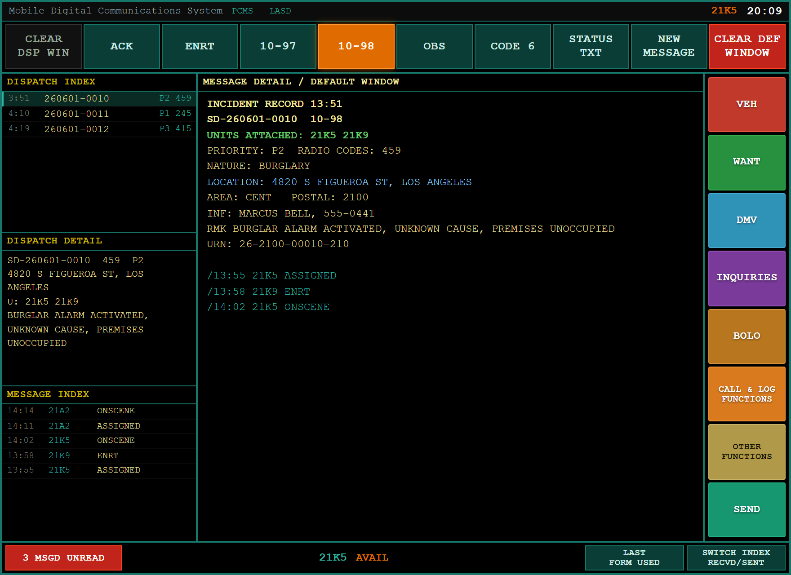
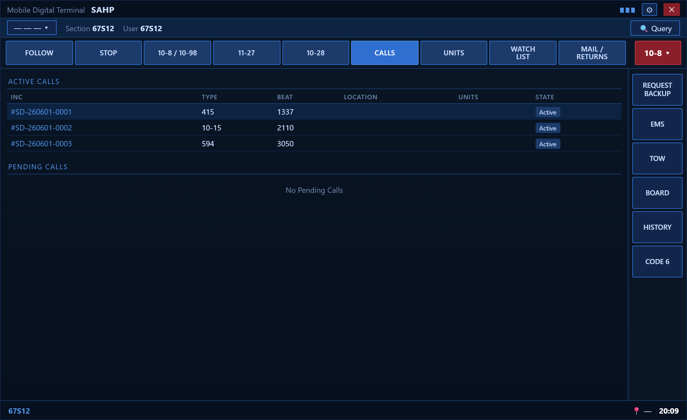
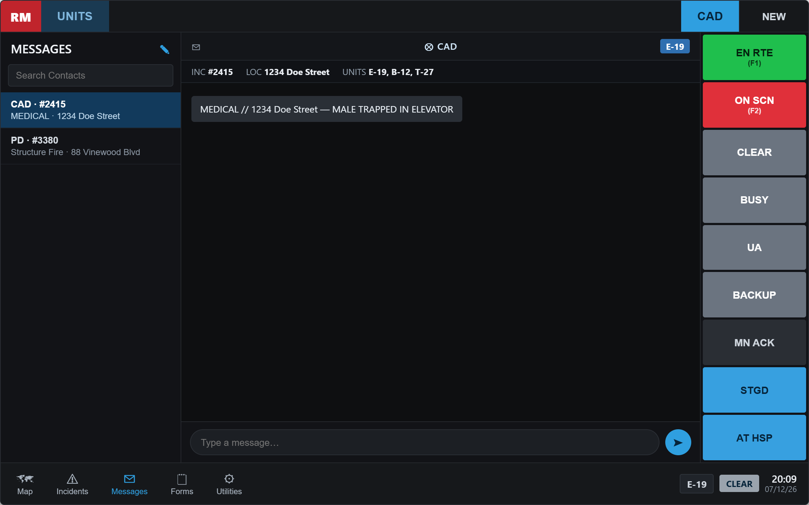

# LASD CAD / PCMS

The **CAD/PCMS terminal** is the in-car computer for **every agency except LAPD** — Sheriff (LASD), Fire, EMS, Coroner, and any other department your server runs. It's modeled on the real LASD Toughbook **PCMS** (amber text, teal status keys), and shares the same incidents, units and records as the LAPD MDT and the dispatch console.

> 📑 **Related:** [Using the MDT](/user-guide/mdt) · [Dispatch console](/user-guide/dispatch-console) · [Citations & Charges](/user-guide/citations-charges)

---

## 🚓 Opening it

Go on duty with a non-LAPD department, then open your terminal the same way as the MDT:

```
/mdt        # opens the CAD/PCMS if your dept isn't LAPD
/lasd       # always opens the CAD/PCMS
```

LAPD officers get the [LACORE Mobile Client](/user-guide/mdt) instead; everyone else gets this terminal.



---

## 🎨 Terminal skins by department

Non-LAPD departments each get a terminal skinned to their agency — all sharing the **same incidents, units, statuses and records**:

- **Sheriff / LASD** → the amber **PCMS** shown above.
- **CHP / state & other law-enforcement agencies** → the dark-blue **Agency MDT**.
- **Fire / EMS / Coroner** → the **EMS / Fire CAD**.
- **Departments tagged `90s`** → the retro **[9100-T terminal](/user-guide/retro-mdt)**.

### Agency MDT (CHP-style)



### EMS / Fire CAD



---

## 🗺 Layout at a glance

```
┌───────────────────────────────────────────────────────────────────────┐
│ PCMS — LASD                                   12A   15:23              │
├──────────────┬──────────────────────────────────┬─────────────────────┤
│ DISPATCH     │  MESSAGE DETAIL / DEFAULT WINDOW  │  VEH                │
│ INDEX        │                                   │  WANT               │
│  2110 0001   │   INCIDENT RECORD …               │  DMV                │
│  2112 0002   │   SD-260617-0001  10-97           │  INQUIRIES          │
│ ──────────── │   UNITS ATTACHED: 12A             │  CALL & LOG         │
│ DISPATCH     │   PRIORITY: P2  RADIO CODES: 415  │  OTHER              │
│ DETAIL       │   LOCATION: 1 VERMONT AVE         │  SEND               │
│ ──────────── │   …                               │                     │
│ MESSAGE      │                                   │                     │
│ INDEX        │                                   │                     │
├──────────────┴──────────────────────────────────┴─────────────────────┤
│ [ACK] [ENRT] [10-97] [10-98] [OBS] [CODE 6]      12A   AVAIL           │
└───────────────────────────────────────────────────────────────────────┘
```

- **Dispatch Index** — active calls (yours + bridged dispatch/911 incidents).
- **Dispatch Detail** — a condensed view of the selected call.
- **Message Index** — a live, timestamped activity feed across all incidents.
- **Center window** — the full incident record, query results, and forms.
- **Function buttons** (right) — VEH / WANT / DMV / inquiries, create a call, settings, SEND.
- **Status row** (bottom) — your unit status keys.

---

## 🔄 Status & attaching to calls

Select a call in the **Dispatch Index**, then use the status keys:

| Key | Meaning |
|-----|---------|
| **ACK** | Acknowledge — **attaches you to the selected call** and sets you **ENROUTE** |
| **ENRT** | En route |
| **10-97** | On scene |
| **10-98** | Available / clear — on a selected call this opens the **clear/disposition form** |
| **OBS** | Out of service / busy |
| **CODE 6** | Code 6 (out investigating) |

> Pressing **ACK** on a call works just like the LAPD console: you're attached and flipped to **ENROUTE** in one tap.

Attached units are shown right on the incident record (`UNITS ATTACHED: 12A`).

---

## 🖱 Right-click a call

Right-click any incident in the **Dispatch Index** for a quick menu:

- **ACK / Attach** — attach yourself and go ENROUTE.
- **Resolve incident** — opens the clear/disposition form to close it out.

---

## ✅ Clearing a call (10-98)

Pressing **10-98** on a selected call opens the **clear form** — pick a disposition (code), add a narrative, and confirm. The incident is resolved everywhere (CAD, dispatch console, audit log). This works for both LASD calls and **bridged dispatch/911 incidents** (`PD-…`).

---

## 🔎 Queries & records

The **VEH / WANT / DMV** buttons run the shared databases — plates, wants/warrants, and person files. Results render in the amber center window, including any **file notes, citations and charges** filed against the subject (see [Citations & Charges](/user-guide/citations-charges)) and active **[BOLO](/user-guide/bolo)** hits.

Use **CALL & LOG FUNCTIONS** to create a new Call for Service (CFS) from the terminal.

