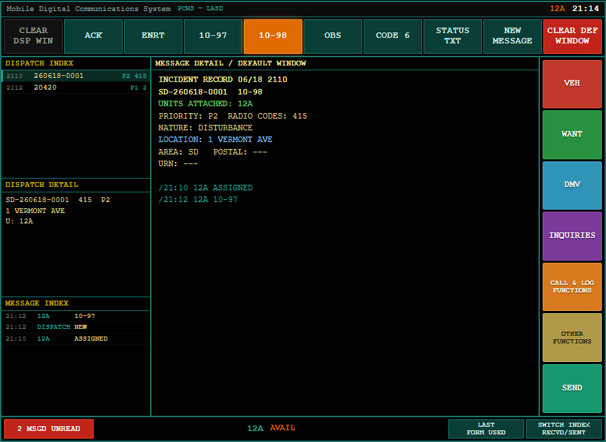
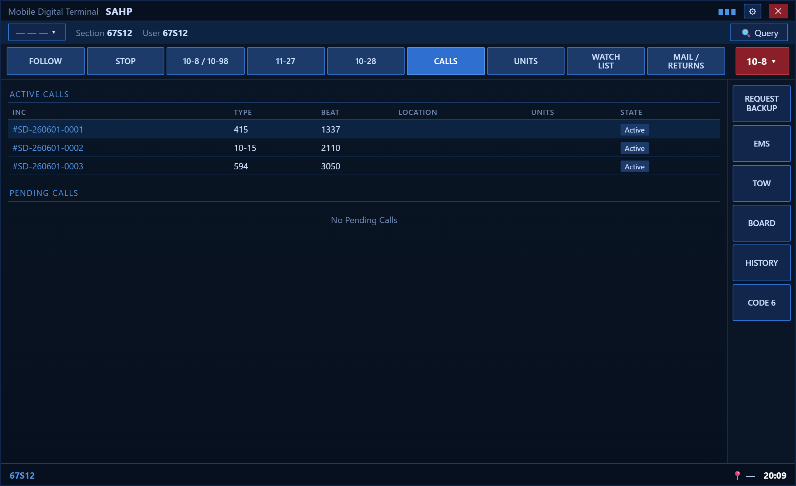
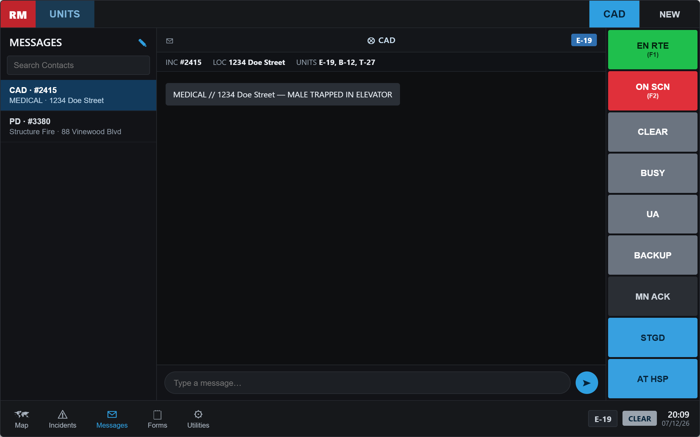

# LASD CAD / PCMS

The **CAD/PCMS terminal** is the in-car computer for **Sheriff departments** (LASD / BCSO), modeled
on the real LASD Toughbook **PCMS** (amber text, teal status keys). This page also covers its
**sibling skins** — every non-LAPD department gets a terminal in this family (Agency MDT, EMS CAD,
9100-T; see [Terminal skins](#-terminal-skins-by-department) below), all sharing the same
incidents, units and records as the LAPD MDT and the dispatch console.

> 📑 **Related:** [Using the MDT](/user-guide/mdt) · [Dispatch console](/user-guide/dispatch-console) · [Citations & Charges](/user-guide/citations-charges)

The terminal was rebuilt in **3.5.0** after the LASD-MDC design — this is the current screen layout:


## 🎨 Two skins, one terminal

The classic amber/teal PCMS was **kept**. Open **OTHER FUNCTIONS → TERMINAL SKIN** and pick:

| Skin | Look |
| --- | --- |
| **MDC** *(default)* | The new design above — teal status keys, yellow section headers, the blue command bar, HANDLE / BACK / CLEARANCE FORM. |
| **CLASSIC PCMS** | The original amber-on-black terminal with the coloured function rail (plus a MAP key since 4.0). |

Your choice is remembered per player and survives a restart. Both skins are the **same terminal
underneath**: the same incidents, units, queries and server rules — only the screen differs, so a
department can run both side by side.

---

## 🚓 Opening it

Go on duty with a non-LAPD department, then open your terminal the same way as the MDT:

```
/mdt        # opens the terminal your department routes to (see below)
/lasd       # always opens the CAD/PCMS
```

`/mdt` picks the terminal by department: **LAPD** → [LACORE Mobile Client](/user-guide/mdt),
**LASD / Sheriff / BCSO** → this CAD/PCMS, **Fire/EMS/Coroner** → the EMS CAD, and every other
law-enforcement agency → the Agency (CHP-style) MDT.



---

## 🎨 Terminal skins by department

Non-LAPD departments each get a terminal skinned to their agency — all sharing the **same incidents, units, statuses and records**:

- **Sheriff / LASD** → the amber **PCMS** shown above.
- **CHP / state & other law-enforcement agencies** → the dark-blue **Agency MDT**.
- **Fire / EMS / Coroner** → the **EMS / Fire CAD**.
- **Departments tagged `90s`** → the retro **[9100-T terminal](/user-guide/retro-mdt)**.

### Agency MDT (CHP-style)



### EMS / Fire CAD



The **Map** tab (bottom bar) shows a live map of the EMS incidents with a position and the on-duty
units (your own outlined), with the server's map images and named locations from
`configs/cfg-livemap-sh.lua`. Clicking an incident selects it and opens its messages. The waypoint
list below the map still sets a GPS waypoint to an incident.


---

## 🗺 Layout at a glance

```
┌───────────────────────────────────────────────────────────────────────┐
│ PCMS — LASD                                   12A   15:23              │
├──────────────┬──────────────────────────────────┬─────────────────────┤
│ DISPATCH     │  MESSAGE DETAIL / DEFAULT WINDOW  │  VEH                │
│ INDEX        │                                   │  WANT               │
│  2110 0001   │   INCIDENT RECORD …               │  DMV                │
│  2112 0002   │   SD-260617-0001  10-97           │  INQUIRIES          │
│ ──────────── │   UNITS ATTACHED: 12A             │  CALL & LOG         │
│ DISPATCH     │   PRIORITY: P2  RADIO CODES: 415  │  OTHER              │
│ DETAIL       │   LOCATION: 1 VERMONT AVE         │  SEND               │
│ ──────────── │   …                               │                     │
│ MESSAGE      │                                   │                     │
│ INDEX        │                                   │                     │
├──────────────┴──────────────────────────────────┴─────────────────────┤
│ [ACK] [ENRT] [10-97] [10-98] [OBS] [CODE 6]      12A   AVAIL           │
└───────────────────────────────────────────────────────────────────────┘
```

- **Dispatch Index** — active calls (yours + bridged dispatch/911 incidents).
- **Dispatch Detail** — a condensed view of the selected call.
- **Message Index** — a live, timestamped activity feed across all incidents.
- **Center window** — the full incident record, query results, and forms.
- **Function buttons** (right) — VEH / WANT / DMV / inquiries, create a call, settings, SEND.
- **Status row** (bottom) — your unit status keys.

### Map


Both skins have it:

- **MDC:** press **NEW MESSAGE**, type **MAP** and press Enter.
- **Classic PCMS:** press the **MAP** key in the coloured function rail (under BOLO).

The Message Detail / Default window turns into a live map:

- every active incident with a position (labelled like the index rows, e.g. `0042 415`) and every
  on-duty unit, your own outlined;
- the server's own map images (an on/off button per image) and named locations from
  `configs/cfg-livemap-sh.lua`, as on the other terminals;
- clicking an incident opens its incident record. On the MDC, **CLEAR DEF WINDOW** closes the map.


---

## 🔄 Status & attaching to calls

Select a call in the **Dispatch Index**, then use the status keys:

| Key | Meaning |
|-----|---------|
| **ACK** | Acknowledge — **attaches you to the selected call** and sets you **ENROUTE** |
| **ENRT** | En route |
| **10-97** | On scene |
| **10-98** | Available / clear — on a selected call this opens the **clear/disposition form** |
| **OBS** | Out of service / busy |
| **CODE 6** | Code 6 (out investigating) |

> Pressing **ACK** on a call works just like the LAPD console: you're attached and flipped to **ENROUTE** in one tap.

Attached units are shown right on the incident record (`UNITS ATTACHED: 12A`).

---

## 🖱 Right-click a call

Right-click any incident in the **Dispatch Index** for a quick menu:

- **ACK / Attach** — attach yourself and go ENROUTE.
- **Resolve incident** — opens the clear/disposition form to close it out.

---

## ✅ Clearing a call (10-98)

Pressing **10-98** on a selected call opens the **clear form** — pick a disposition (code), add a narrative, and confirm. The incident is resolved everywhere (CAD, dispatch console, audit log). This works for both LASD calls and **bridged dispatch/911 incidents** (`PD-…`).

---

## 🔎 Queries & records

The **VEH / WANT / DMV** buttons run the shared databases — plates, wants/warrants, and person files. Results render in the amber center window, including any **file notes, citations and charges** filed against the subject (see [Citations & Charges](/user-guide/citations-charges)) and active **[BOLO](/user-guide/bolo)** hits.

Use **CALL & LOG FUNCTIONS** to create a new Call for Service (CFS) from the terminal.

