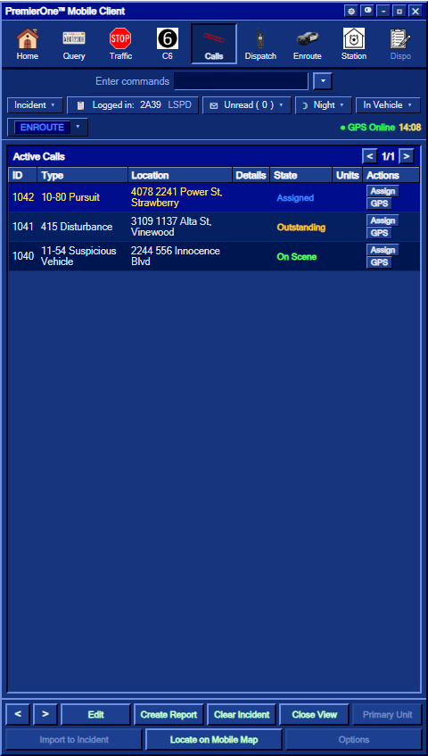
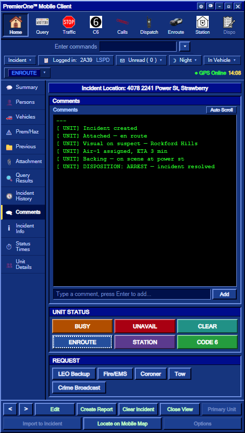
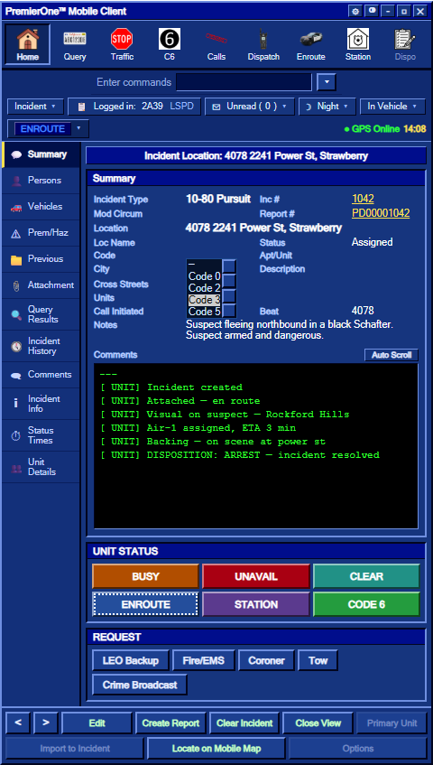
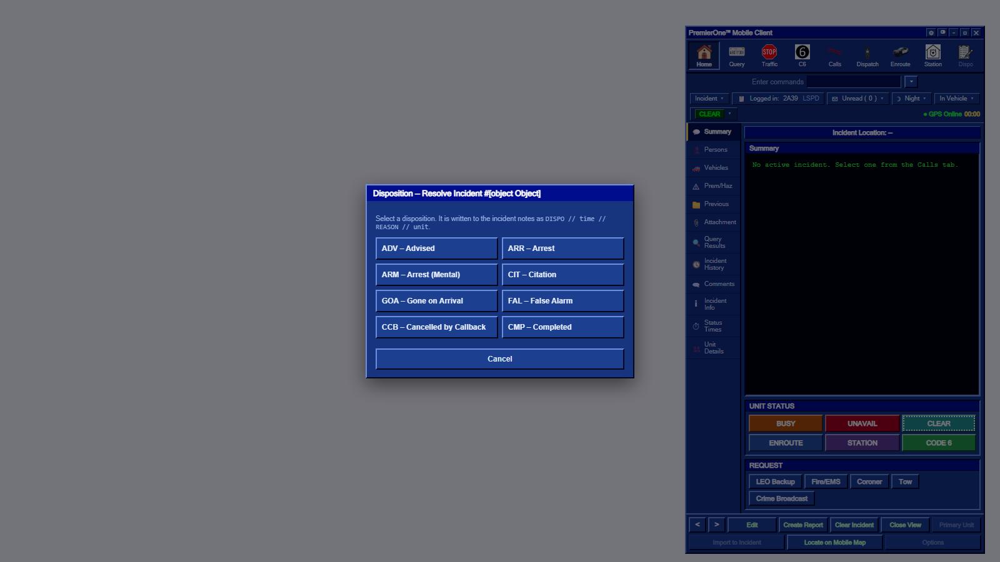
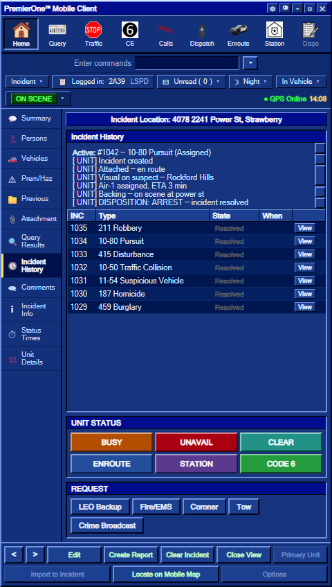
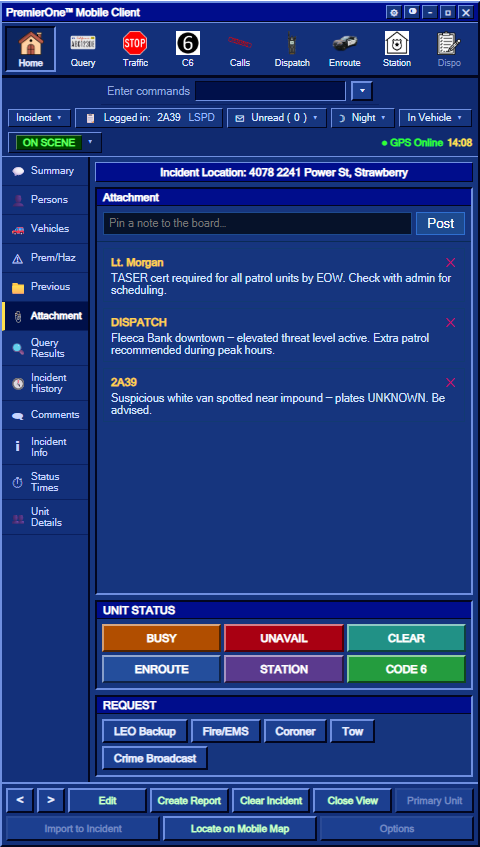
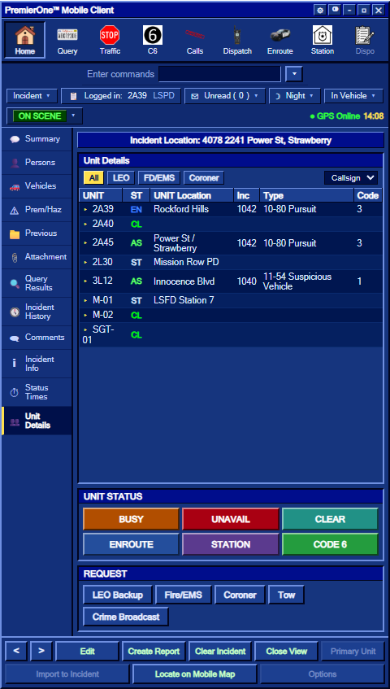

# Working with Incidents

Everything an incident does inside the MDT: how to create one, attach yourself, comment, set the response code, resolve, and find old ones again. Plus the **Bulletin Board** ("Schwarzes Brett") on the Attachment tab.

---

## 📞 The Calls tab — active incidents

Switch to **Calls** from the toolbar (or via **/dispatch**'s active list). It shows **every active (non-resolved) incident** in the CAD.




| Column | Meaning |
|---|---|
| **ID** | Incident number (e.g. `20011`) |
| **Type** | `Traffic Stop`, `Code 6`, `Incident`, `911 Emergency`, `311 Non-Emergency`, `Panic Button`, `Crime Broadcast` … |
| **Location** | Postal + street |
| **Details** | Original call message |
| **State** | `Outstanding`, `Assigned`, `On Scene`, `Resolved` |
| **Units** | Callsigns currently attached |
| **Actions** | **Assign** (attach yourself + ENROUTE) · **GPS** (set waypoint) |

A row in **bold yellow** is **unread** — a new incident you haven't viewed yet.

Click a row to **select** it; it becomes your active incident in the Home view.

> 🔊 **Sound cues:** new incidents created by an officer play `mdtentry.ogg` for **every on-duty unit**. New comments on an incident you're attached to play the same sound. A 3-second cooldown per sound prevents spam.

---

## ➕ Creating an incident

There are three ways for an officer to create an incident from the MDT:

### Traffic Stop (🛑 Traffic toolbar button)

- Creates a **Traffic Stop** incident at your current street
- Auto-sets your status to **CODE SIX**
- Auto-attaches you as the primary unit
- Broadcasts the new incident to all on-duty units (with a sound cue)


### Code 6 (⑥ C6 toolbar button)

- Creates a **Code 6** incident (general "out on a scene")
- Auto-sets your status to **CODE SIX**
- Auto-attaches you

### Manual incident

Some workflows let you type an incident manually with free-text details (kind = `manual`). The handler accepts up to 180 characters of details and does **not** force a status change.

### What happens server-side

For each created incident, the server:

1. Allocates the next incident number
2. Stores it in the `calls` store (DB + JSON mirror)
3. Logs the creation in the audit trail (admin-only, `/calllog`)
4. Pushes a fresh `SyncCalls` to every open MDT/Dispatch
5. Sends the `mdtentry.ogg` sound to every on-duty unit (client-side cooldown protects against spam)
6. Sets your `incident` field to the new number

> ⚠️ **Spam protection:** the same officer can create incidents **at most once every 3 seconds**. Faster clicks are silently dropped with a notify — no broadcast, no sync, no sound.

---

## 🧷 Attaching yourself to an incident

From the **Calls** tab, click **Assign** on a row. The server:

- Sets your status to **ENROUTE**
- Attaches you to the incident
- Posts an entry in the incident comments: *"Assigned — en route"*
- Updates the call state to **Assigned**
- Notifies you

Dispatchers can also assign you (or any unit) via the Dispatch Console — see [Dispatch Console](/user-guide/dispatch-console).

---

## 📝 Comments (= incident audit log)

The **Comments** sub-tab is the running log for the incident. Anything important you do in the CAD shows here:

- Manual comments you type in the Comments input
- System events (assigned, state changed, **response code set**, resolved, …)
- Dispositions when an incident is cleared




Comments are persisted in the `calls` store (DB + JSON mirror) and visible in the Summary's narrative section too.

> 🔊 **Sound cue:** every unit attached to the incident hears `mdtentry.ogg` when a new comment lands (3-second cooldown).

---

## 🚦 Response code (the "Code" column)

Each incident has a **response code** — how fast units should respond:

| Code | Meaning |
|---|---|
| *(empty)* | No incident / not set |
| **0** | Routine |
| **2** | Standard emergency response |
| **3** | High-priority emergency response |
| **5** | Special / urgent |

**Auto-assigned at creation:**
- `311 Non-Emergency` → **Code 2**
- `911 Emergency` → **Code 3**

All other types start with an empty code and you can set it yourself in the **Summary** or **Incident Info** sub-tab. The change is logged as a comment.




---

## ✅ Resolving an incident

Click **Clear Incident** in the bottom action bar (or use the **Dispo** toolbar button).




Pick a **disposition** code (3-6 letters, e.g. `UTL`, `GOA`, `ARR`, `CMP`). The server:

1. Sets the incident's state to **Resolved**
2. Appends to notes: `DISPO // <time> // <reason> // <unit>`
3. **Adds a comment** to the audit log: *"DISPOSITION: &lt;reason> — incident resolved"*
4. Records the resolution in the admin audit
5. Sends the **final** state to you (so your panel still shows the resolved incident)
6. **Removes** the incident from the active broadcast (other terminals no longer see it on the Calls tab)

Resolved incidents remain in the **`calls` store** for `CallRetentionDays` (default 7 days), so they're searchable in **Incident History**.

---

## 🕔 Incident History

The **Incident History** sub-tab is your **archive of resolved incidents** — handy for reviewing what happened earlier in the shift or finding a specific incident again.




The view shows:

- **Top section** — quick recap of the currently active incident (if any)
- **Bottom section** — paginated table of resolved incidents, **newest first**, up to 200

Each row:

| Column | Meaning |
|---|---|
| **INC** | Incident number |
| **Type** | Original type (Traffic Stop, 911, …) |
| **State** | Always `Resolved` here |
| **When** | Date the incident was created |
| **View** | Load this incident back into your Home view (read-only) |

The list **scrolls within the panel** — no matter how many entries there are, the UNIT STATUS and REQUEST strips at the bottom stay visible.

> 💡 **Tip:** searching is by scrolling for now. If your shift had 200+ incidents, ask a dispatcher to use `/calllog <number>` from the server console.

---

## 📌 Attachment — the Bulletin Board ("Schwarzes Brett")

The **Attachment** sub-tab is the department's shared **bulletin board** — anyone on duty can pin a short note for everyone else.




Use it for:

- "Watch for a red Sultan with a busted tail-light in Vinewood"
- "Code 3 to anyone responding to 4500 Innocence — BOL details inside"
- Shift handover notes
- Supervisor announcements

How it works:

- **Post** — type up to **240 characters**, hit `Enter` or click *Post*. The note is saved server-side (DB store `board`, mirrored to `data/board.json`) and broadcast to every open MDT.
- **Delete** — click the **✕** on any note you posted. **Staff** can delete anyone's note.
- **Limit** — the board keeps the **100 most recent** entries; older ones drop off automatically.
- **Identification** — each entry shows the author's **callsign** + **time**.

> 🛡️ This is technically open to all on-duty units. Use it responsibly — it's not a chat. **Repeat offenders can be moderated by staff** (and the audit trail records every post).

---

## 🧑‍✈️ Persons & Vehicles sub-tabs

- **Persons** — after a successful **Query** run, the matched person's record (DL, warrant, physical, notes, registered vehicles) shows here automatically. See [Query: Running People & Plates](/user-guide/mdt-query).
- **Vehicles** — vehicles linked to the active incident.

---

## 🚗 Unit Details — the all-units view

Click **Unit Details** in the left rail to see every on-duty unit at once.




Columns (narrow on purpose so a lot of units fit):

| Column | Meaning |
|---|---|
| **UNIT** | Callsign. Click to **expand** and see the officer(s) in that unit (▸ / ▾) |
| **ST** | 2-letter status code (CL / EN / AS / C6 / BY / UA / ST) — full status on hover |
| **UNIT Location** | Street the unit is at; **CLEAR = empty**, **STATION = "OUT TO STATION"** (or custom text) |
| **Inc** | Incident number the unit is attached to (blank if none) |
| **Type** | Incident type |
| **Code** | Response code for that incident (auto from 311/911, manual otherwise) |

**Filter buttons:** `All` · `LEO` · `FD/EMS` · `Coroner`
**Sort dropdown:** Callsign (natural) · Status · Default (server order)

**Editing your own Location** — click the Location cell on **your own row** to type a custom override (useful when STATION / BUSY / UNAVAIL away from your home base). Saved server-side; cleared automatically when you go CLEAR.

> 💡 Units sharing the same callsign (partners in one car) are **merged into one row**, with a number badge `(2)` and the dropdown showing both officers.

---

## 🔁 The full lifecycle in one view

```
NEW CALL  →  Outstanding
              │
              ▼  (officer assigns → enroute)
            Assigned
              │
              ▼  (officer arrives)
            On Scene  ◄──┐
              │           │ (comments, status changes, code updates)
              ▼           │
            Clear Incident (Dispo modal)
              │
              ▼
            Resolved  ──►  Incident History (kept for CallRetentionDays)
                            │
                            ▼
                          Pruned (one-time backup written before first prune)
```

---

## See also

- [MDT Toolbar & Status](/user-guide/mdt-toolbar) — every UI element explained
- [Query: Running People & Plates](/user-guide/mdt-query) — `/run`, VREG, stolen-vehicle flow
- [Dispatch Console](/user-guide/dispatch-console) — the full-screen dispatcher CAD
- [Status labels](/support) — what the colour-coded badges mean

