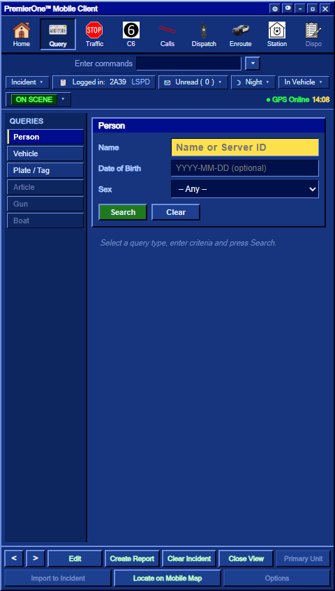
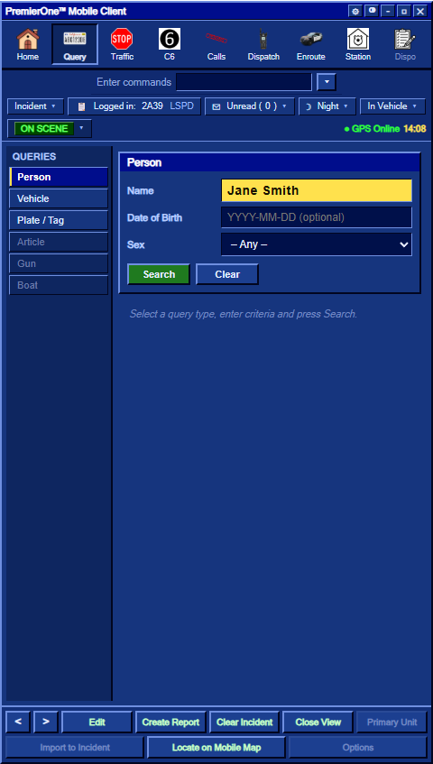
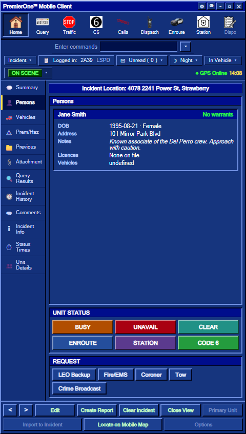

# Query: People & Plates

The **Query** tab is where you look up people, vehicles and plates against the CAD. It works for officers (LEO / Fire / EMS / Coroner) from inside the MDT, or via the `/run` chat command from anywhere.

---

## 📇 The Query tab




The view is split into three types — pick the matching form on the left rail:

| Type | What you can enter | Use case |
|---|---|---|
| **Person** | Full name (or partial), server ID | Run an individual |
| **Vehicle** | Plate, VIN | Pull a registered vehicle (and its owner) |
| **Plate** | Plate only | Same as Vehicle but focused on the plate |

Each form has a **highlighted key field** (yellow) — the primary search input — plus optional secondary fields (DOB, state, etc.) used for record disambiguation.




Hit **Run Query** (or just **Enter** in the key field) to submit.

---

## 🏃 `/run <name or plate>` — the shortcut

From **anywhere** in-game (LEO / Fire / EMS / Coroner only):

```
/run John Doe
/run 12ABC345
/run 27               ← also works with a server ID (online player)
```

What it does:

1. Looks up the input as a **server ID**, then a **plate**, then a **name substring**
2. Pulls the matching record(s) (up to 10 for name searches)
3. **Opens the MDT** if it isn't already open
4. Jumps to the **Query** view, then automatically to the **Persons** sub-tab so the result is front and centre
5. Posts a chat line to all on-duty units: *"&lt;your callsign> ran "John Doe""* (so dispatch / partners know what you queried)

> 💡 The same shortcut is fired by the in-MDT **Run** button — so chat and MDT behave identically.

---

## 👤 The Persons record card

A match shows the full person record:




| Section | Fields |
|---|---|
| **Header** | Name + **WARRANT** banner (red if active) or **No warrants** (green) |
| **BOLO hit** | A bright **ACTIVE BOLO** banner if the person matches an active alert (red for 10-32) — see [BOLO](/user-guide/bolo) |
| **Identity** | DOB, gender, address |
| **Physical** | Height, weight, hair, eyes |
| **Licences** | Driver, commercial, boating, pilot, CCW, hunting (each: `Valid` / `Expired` / `Suspended` / `Revoked` / `None`) |
| **Notes** | Free-text RP info the player put in `/char` — e.g. gang affiliation, medical conditions, etc. **Read these — they're the RP hook.** |
| **Records** | Faction-visible file notes, **citations and arrest reports** filed against the person |
| **Vehicles** | A **Registered Vehicles** list — every plate the person owns, with model / colour / type / year and an **Insured / No-insurance** badge (newest first). Read a suspect's cars straight from their file. |

From the card you can also act on the person:
- **Add note** — file a quick faction-visible note.
- **⚖ Cite / Charge** — write a citation or arrest report from the penal code. See [Citations & Charges](/user-guide/citations-charges).

If a record doesn't exist:

- The person is **online** → the server prompts them to fill in `/char` (a CAD record needs to be created)
- The person is **offline / not in CAD** → no record returned; the Persons tab shows "No person on file"

---

## 🚗 Running a plate — the live registration flow

This is what makes plate runs interesting: **if a plate isn't on file and someone is driving it, they get 15 seconds to register it — or the car is flagged stolen.**


### Step by step

1. **Officer runs an unregistered plate** (`/run <plate>` or the in-MDT plate form)
2. **Server** checks the `civilians` store for a matching `vehicles.<plate>` entry
3. **No match found** → server asks the FiveM network: *"Who is currently driving plate XYZ?"*
4. The matching client (the actual driver) **gets the VREG form popped up automatically** with the plate pre-filled:

   > *"An officer is running your plate. Enter your details within 15s or it will be flagged stolen."*

5. **Meanwhile**, the officer's MDT shows a **"request running" banner** with a **15-second countdown**


### Three outcomes

| Outcome | Result |
|---|---|
| Driver submits VREG **within 15 s** | Plate registers normally · officer sees the result · *"registered"* banner |
| Driver **closes the form** before submitting | **Vehicle flagged stolen** · banner turns red · status saved server-side |
| Driver doesn't submit in time | **Vehicle flagged stolen** (same as above) |

Once a plate is flagged stolen, every subsequent run on that plate returns **STOLEN** until the driver re-registers it.

---

## ✍ Registering your vehicle — `/vreg`

To register a vehicle ahead of time so it doesn't get flagged on a routine run:

1. Sit in the vehicle
2. Type `/vreg`


Fields:

- **Plate** (auto-filled from your current vehicle)
- **Model**, **Owner**, **Color**, **Type** (Sedan, Truck, Bike, …), **Year**

Saved to your `civilians` profile under `vehicles[plate]`. Subsequent runs return your real details.

> ⚠️ Re-running `/char` (saving your civilian profile) **resets** the registered vehicle list. A fresh character starts with no vehicles and must re-`vreg`.

---

## 🧑‍✈️ Querying by server ID

Officers can run an **online player** by their server ID:

```
/run 27
```

- If `27` has a CAD record → it's returned
- If `27` has **no** CAD record → the server **prompts that player** to fill `/char` so the next run returns a record
- The player gets a chat message: *"MDT: An officer just ran you — please fill in /char so they see a record."*

---

## 🧾 Recent query results

The **Query Results** sub-tab keeps a quick textual summary of the most recent matches (handy when you've ran several people in a row and want to glance back):


Each line: `Name — WARRANT/No warrants — Address`

For the **full** record, jump to **Persons** or re-run.

---

## 🛠 Behind the scenes (technical notes)

- Person records live in `civilians.json` (DB store `civilians`), keyed by license identifier
- `/char` presets are stored per identifier in `char_presets.json` (DB store `char_presets`)
- Stolen-plate flags are in `stolen_plates.json` (DB store `stolen_plates`)
- Every run is announced in the in-game chat to on-duty units (`MDT` prefix, blue)
- Runs are logged in the admin audit (admin-only access via `/calllog`)

For developers building on these stores, see the [Development reference](https://github.com/tabysi/pvp-corev3-community/blob/main/.github/DEVELOPMENT.md) in the source repo.

---

## See also

- [Working with Incidents](/user-guide/mdt-incidents) — what to do after a query
- [Civilian & Vehicles](/user-guide/civilian-vehicles) — civilian-side overview
- [Command reference](/commands) — full list of `/run`, `/char`, `/vreg`

