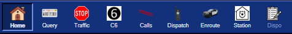
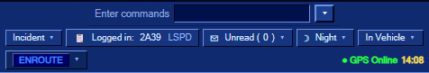
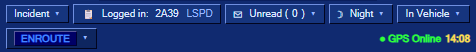
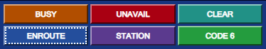
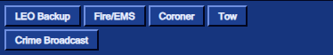
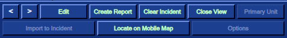
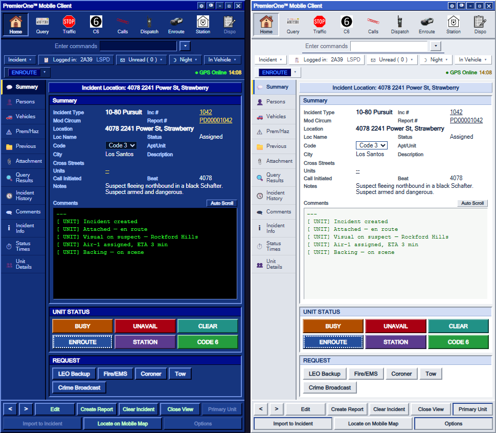
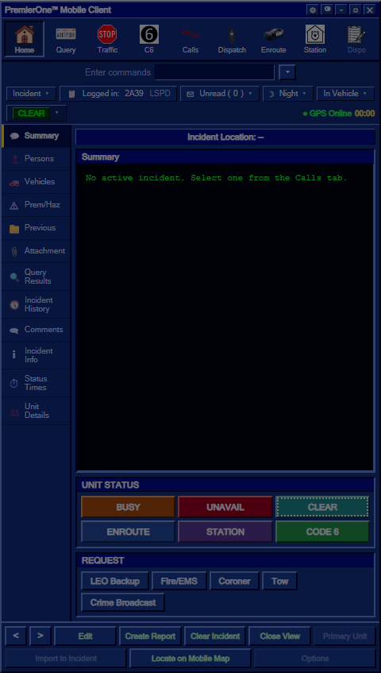

# MDT Toolbar & Status

Every button, dropdown and status indicator in the MDT, top to bottom.

---

## 🛠 Toolbar (the row of icons at the top)

| Icon | Button | What it does |
|---|---|---|
| 🏠 | **Home** | Switch to the Home view (active incident workspace) |
| 📇 | **Query** | Open the Query view (run a person, vehicle, or plate) |
| 🛑 | **Traffic** | **Create a Traffic Stop incident** at your current street and auto-set your status to **CODE 6** |
| ⑥ | **C6** | **Go Code 6** at your current street (create a Code 6 incident, set status CODE SIX) |
| 📞 | **Calls** | Switch to the active-calls list (all open incidents in the CAD) |
| 🎙 | **Dispatch** | Switch to the in-MDT Dispatch chat view — talk to dispatchers without leaving your car |
| 🚓 | **Enroute** | Quickly set your status to **ENROUTE** |
| 🏢 | **Station** | Set your status to **OUT TO STATION** (and clear your active incident assignment) |
| 📋 | **Dispo** | Open the **Disposition** modal to clear/close your current incident with a reason |

> 💡 **Traffic** and **C6** also create incidents that get broadcast to everyone on duty — including a sound cue (`mdtentry.ogg`). They are *not* just status changes.

> ⚠️ **Spam protection:** the server rate-limits incident creation to **one every 3 seconds per officer**, so button-mashing won't broadcast a flood of incidents or sounds. Spam clicks are silently dropped with a brief notify.

---

## 🎚 Command bar (the row of dropdowns below the toolbar)

| Field | Meaning |
|---|---|
| **Enter commands** | Free-text command box (RP/typed commands) |
| **Incident ▾** | Quick navigator for your active incident |
| **Logged in: &lt;callsign> &lt;agency>** | Your current on-duty identity |
| **Unread (n) ▾** | Number of unread/new incidents you haven't viewed |
| **Day/Night ▾** | Time of day indicator |
| **In Vehicle ▾** | Whether you're seated in a unit |

---

## 🧭 Status bar (below the command bar)

The **left side** shows your current **unit status** as a dropdown — click it to set your status to any valid value (instead of using the status grid below).

The **right side** shows:

- **● GPS Online** — your position is being reported to dispatch / the map
- **&lt;HH:MM>** — current in-game time

---

## 🗂 Left rail (sub-tabs of the Home view)

Each entry switches the main panel between different views of the **currently selected incident** (or general workspace if no incident is selected). Detailed contents are in [Using the MDT](/user-guide/mdt#the-home-view-active-incident-workspace) and [Working with Incidents](/user-guide/mdt-incidents).

Sub-tabs you'll use most:

- **Summary** — at-a-glance view of the incident + comment narrative
- **Persons** — pops up after a successful `/run` query
- **Comments** — add commentary; *new comments play a sound for every attached unit*
- **Incident History** — searchable archive of resolved incidents
- **Unit Details** — every on-duty unit on one screen
- **Attachment** — the department **Bulletin Board** (a.k.a. "Schwarzes Brett")

---

## 🔘 Status grid (below the main panel)

Quick buttons to change **your own status**:

| Button | Status | ST Code | When to use |
|---|---|---|---|
| **BUSY** | `BUSY` | `BY` | Currently occupied, can't take calls |
| **UNAVAIL** | `UNAVAILABLE` | `UA` | Off the air for a longer period |
| **CLEAR** | `CLEAR` | `CL` | Available for assignment |
| **ENROUTE** | `ENROUTE` | `EN` | Heading to a call |
| **STATION** | `OUT TO STATION` | `ST` | At the station / off the road |
| **CODE 6** *(LEO)* | `CODE SIX` | `C6` | Investigating / out on a scene |
| **ON SCENE** *(Fire/EMS)* | `ON SCENE` | `AS` | Arrived at the incident |

The grid auto-adapts to your role: LEO sees **CODE 6**; Fire/EMS sees **ON SCENE**.

Your current status is **highlighted** (subtle border / coloured outline).

> See [Status labels](/support) for what the colour-coded badges mean across the CAD.

---

## 📣 Request grid (below the status grid)

Quick action to ping other units / services on the channel. Each button fires the appropriate radio message:

| Button | What it does |
|---|---|
| **LEO Backup** | Requests law-enforcement backup to your location |
| **Fire/EMS** | Requests fire / EMS response |
| **Coroner** | Requests the coroner |
| **Tow** | Requests a tow truck |
| **Crime Broadcast** *(LEO)* | Broadcasts a crime alert (`/cb` equivalent) — your callsign + current street + your message |

---

## 🎯 Bottom action bar

| Button | What it does |
|---|---|
| **&lt; / >** | Cycle through active incidents (same as **↑ / ↓** arrows) |
| **Edit** | Edit the active incident |
| **Create Report** | Create a follow-up report |
| **Clear Incident** | Resolve the active incident with a **disposition** (UTL, GOA, ARR, CMP …) — see [Working with Incidents](/user-guide/mdt-incidents#resolving-an-incident) |
| **Close View** | Close the open detail/modal view |
| **Primary Unit** | Mark yourself as the primary unit on this incident |
| **Import to Incident** | Pull related records into the incident |
| **Locate on Mobile Map** | Set GPS / waypoint to the incident location |
| **Options** | Misc options |

---

## ⌨ Keyboard shortcuts while the MDT is open

| Key | Action |
|---|---|
| **O** | Toggle open / close |
| **ESC** | Close the topmost layer (modal → dispatch → MDT) |
| **Backspace** | Same as ESC, but ignored when typing in a text field |
| **← / →** | Previous / next tab |
| **↑ / ↓** | Previous / next incident or list item |
| **Enter** | Submit input (comments, chat, plate, …) inside its field |

---

## 🎨 Theme & appearance

The default theme is the dark **CAD Blue**. Switch to **White Mode** (light, high-contrast — useful in daylight or for streaming) via:

- The **◙** circle icon in the title bar
- The `/mdttheme [white|normal]` command (no arg toggles)
- Persisted in `localStorage` per client

---

## ⚙ Settings & positioning

Open the **⚙** gear in the title bar:

- **Opacity** — slider 50–100 % (drop it if the MDT covers something important)
- **Scale** — 0.8–1.4× (handy on ultrawide / 4K)
- **Position** — `Right` (default), `Center`, `Left`, or **`Custom (dragged)`**

Dragging the title bar switches Position to `Custom (dragged)` automatically. All values are saved per client.

