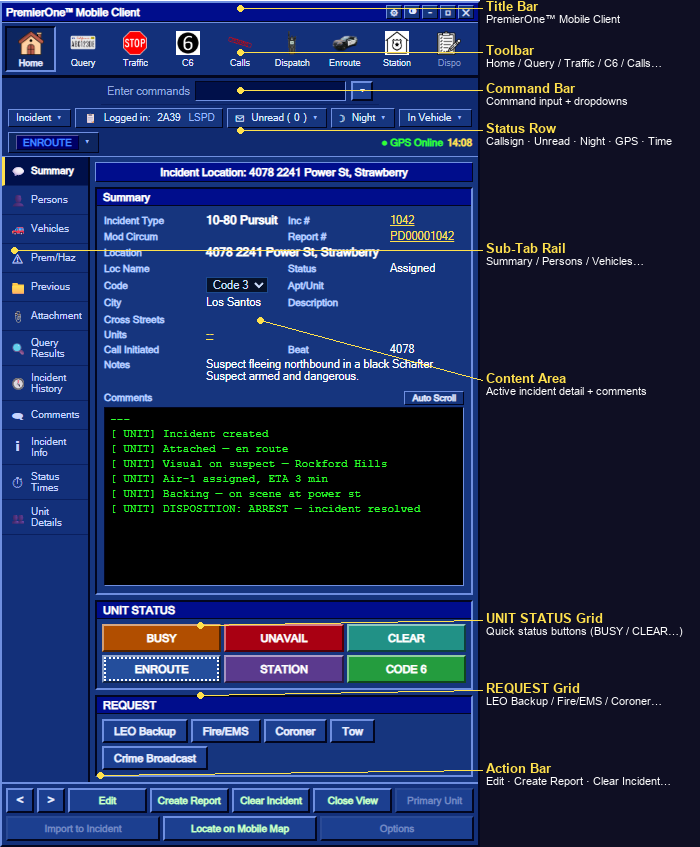

# Using the MDT

The MDT (Mobile Data Terminal) is the in-car CAD for **Law Enforcement**, **Fire/EMS**, and **Coroner** units. It's a retro, portrait in-vehicle terminal — the central hub for working incidents, running queries, managing your status, and talking to dispatch.

> 📑 **Deep dives:**
> - [MDT Toolbar & Status](/user-guide/mdt-toolbar) — every button explained
> - [Working with Incidents](/user-guide/mdt-incidents) — create, attach, resolve, history, board
> - [Query: Running People & Plates](/user-guide/mdt-query) — `/run`, VREG flow, stolen plates

---

## Opening & closing

| Action | Default |
|---|---|
| **Open / close** | **O** key · `/mdt` command |
| Close also via | **ESC** · **Backspace** (outside text fields) · the **✕** in the title bar |
| Switch tabs | **← / →** arrow keys (when no input is focused) |
| Move through incidents/calls | **↑ / ↓** arrow keys |

Only **on-duty** LEO / Fire / EMS / Coroner can open it. Go on duty with:
```
/onduty <agency> <callsign>     e.g. /onduty LAPD 1A-12
```


---

## While the MDT is open

The MDT is designed so you can **still play the game** with it on screen:

- ✅ **Move** your character normally (WASD)
- ✅ **Talk on the radio** (pma-voice "funken" key) — the radio binding fires even with the MDT focused
- ✅ **Mouse stays on the UI** — clicking buttons doesn't fire your weapon, mouse movement doesn't turn the camera
- ❌ Typing into a text field is captured by the MDT only while that field is focused — your keystrokes never leak into game keybinds

If something is mapped to mouse-click in the game, it's automatically blocked while the MDT is open: attack, aim, melee, weapon wheel, reload, etc.

---

## Layout at a glance

```
┌────────────────────────────────────────────────────────────────┐
│  LACORE Mobile Client                            ⚙ ⊙ – ▢ ✕│  ← Title bar (drag to move)
├────────────────────────────────────────────────────────────────┤
│ 🏠 Home  📇 Query  🛑 Traffic  ⑥ C6  📞 Calls  🎙 Dispatch …    │  ← Toolbar
├────────────────────────────────────────────────────────────────┤
│ [Incident ▾] [Logged in: 1A-12 LAPD] [Unread (0) ▾] [Night ▾] …│  ← Command bar
│ [ OUT TO STATION ▾]                       ● GPS Online   5:12  │  ← Status bar
├──────────┬─────────────────────────────────────────────────────┤
│ Summary  │                                                     │
│ Persons  │     Active incident details / sub-tab content       │
│ Vehicles │                                                     │
│ Prem/Haz │                                                     │
│ Previous │                                                     │
│ Attach.  │                                                     │  ← Left rail (sub-tabs)
│ Query Re.│                                                     │      + main content area
│ Inc Hist.│                                                     │
│ Comments │                                                     │
│ Inc Info │                                                     │
│ Status T.│                                                     │
│ Unit Det.│                                                     │
├──────────┴─────────────────────────────────────────────────────┤
│ UNIT STATUS:  BUSY  UNAVAIL  CLEAR  ENROUTE  STATION  CODE 6   │  ← Status grid
│ REQUEST:      LEO Backup   Fire/EMS  Coroner  Tow  Crime Br.   │  ← Request grid
├────────────────────────────────────────────────────────────────┤
│ < >  Edit   Create Report   Clear Incident   Close View   …    │  ← Bottom action bar
└────────────────────────────────────────────────────────────────┘
```




What each area does is detailed in **[MDT Toolbar & Status](/user-guide/mdt-toolbar)**.

---

## The Home view (Active Incident workspace)

The **Home** tab shows the **currently selected incident** (the one you're attached to or just clicked on). The **left rail** drives which sub-view is shown in the main panel:

| Sub-tab | What it shows |
|---|---|
| **Summary** | Incident field-mask (type, location, code, units, beat, notes) + comment narrative |
| **Persons** | Person record from a recent `/run` query (DL/warrant/notes/vehicles). Auto-jumps here after a successful query. |
| **Vehicles** | Vehicles attached to the incident |
| **Prem/Haz** | Premise hazards (warnings about a location) |
| **Previous** | Other incidents at the same postal |
| **Attachment** | Department **Bulletin Board** ("Schwarzes Brett") — everyone on duty can pin notes |
| **Query Results** | Quick textual summary of the last query |
| **Incident History** | All resolved/closed incidents — searchable archive |
| **Comments** | The incident's running comment log (= audit trail) with an Add-Comment field |
| **Incident Info** | Same field-mask as Summary, no narrative — pure fields |
| **Status Times** | Timestamps & state metadata |
| **Unit Details** | All on-duty units (UNIT / ST / Location / Inc / Type / Code), filterable, sortable, expandable to show officers |


---

## Settings (⚙ icon in the title bar)

| Setting | Effect |
|---|---|
| **Opacity** | MDT transparency — see the world behind |
| **Scale** | Resize the whole MDT (useful for ultrawide / 4K) |
| **Position** | Preset positions (Right, Center, Left) **or** `Custom (dragged)` |
| **Theme** | `Normal` (CAD blue) or `White` (high-contrast) — also via the **◙** icon in the title bar, or `/mdttheme` |

Drag the **title bar** to move the MDT anywhere — the position is saved per client. The Position setting automatically switches to **Custom (dragged)** when you do.


---

## Quick reference

| Goal | How |
|---|---|
| Open / close | **O** · ESC · Backspace · `/mdt` |
| Switch theme | **◙** in title bar · `/mdttheme [white\|normal]` |
| Settings (opacity, scale, …) | **⚙** in title bar |
| Move | Drag the title bar |
| Cycle tabs | **← / →** |
| Cycle incidents | **↑ / ↓** |
| Run a person/plate | **Query** tab · `/run <name or plate>` |
| Quick traffic stop | **Traffic** toolbar button |
| Go Code 6 | **C6** toolbar button |
| Set status | The status-grid buttons, the **▾** next to your callsign, or the toolbar buttons (Station, Enroute) |

---

## Troubleshooting

- **"It won't open"** — you're not on duty. Run `/onduty <agency> <callsign>`.
- **"The mouse keeps turning the camera"** — outdated build; pull the latest, the camera-look controls are blocked while the MDT is open.
- **"I clicked and shot my gun"** — same as above; attack controls are blocked too in the latest build.
- **"It's covering my view"** — drop the opacity in Settings or drag it to a corner.
- **"I want it back where it was"** — Settings → Position → pick a preset (Right is the original placement).
- **"Unread MDT Calls banner won't go away"** — fixed in 3.0.4; the banner clears when you open the MDT.

