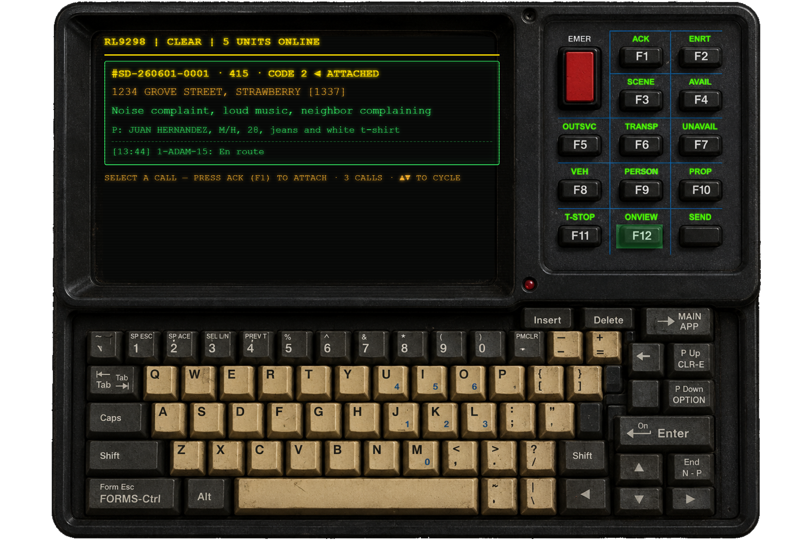
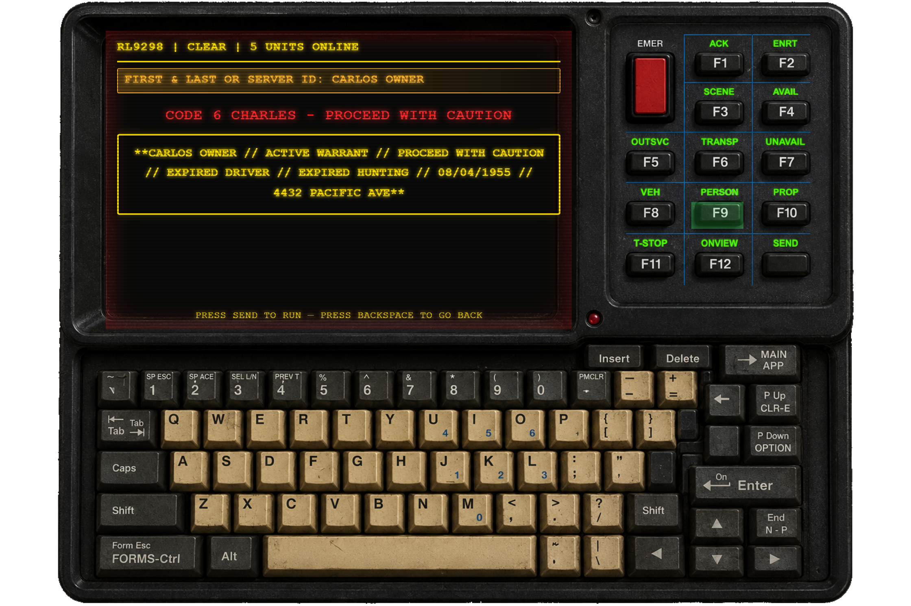
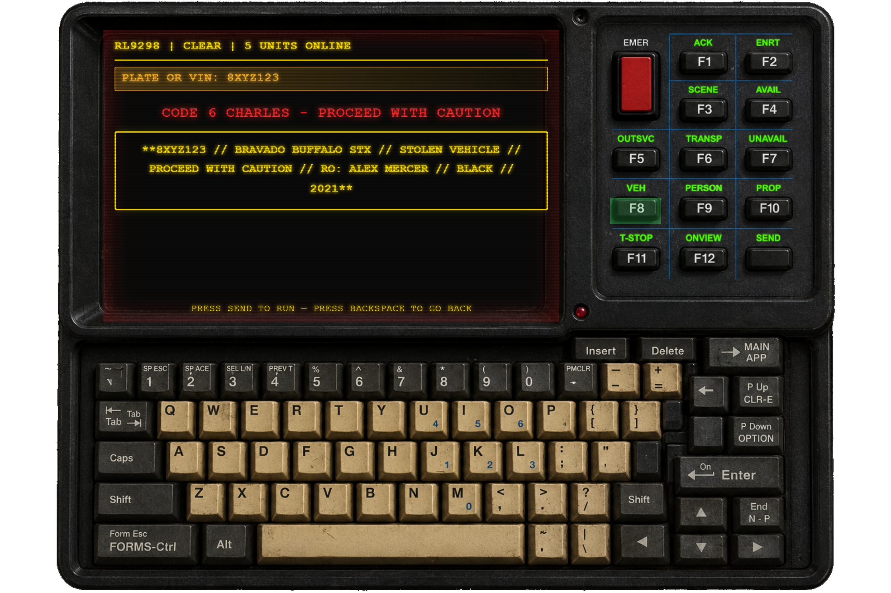

# 9100-T Mobile Data Terminal

The **9100-T** is a 1990s-style in-car terminal — a green-phosphor CRT in a rugged chassis with a labelled function panel and a full clickable keyboard. It's a re-skin of the shared LACORE dispatch backend, so it works with the **same incidents, units, statuses and person/plate queries** as the LAPD MDT, the CAD/PCMS and the dispatch console — just with a retro look and a keyboard-driven workflow.

> 📑 **Related:** [Using the MDT](/user-guide/mdt) · [LASD CAD / PCMS](/user-guide/lasd-cad) · [Dispatch console](/user-guide/dispatch-console)

---

## 🚓 Opening it

The 9100-T opens for any unit whose **department name contains `90s`**. Go on duty with such an agency, then open the terminal like any MDT:

```
/onduty RL90s RL9298     # any agency short-code containing "90s"
/mdt                     # opens the 9100-T for a "90s" department
```

Every other department gets the [LACORE Mobile Client](/user-guide/mdt) or the [CAD/PCMS](/user-guide/lasd-cad) instead.



The title line always reads **`CALLSIGN | STATUS | N UNITS ONLINE`**. The home screen shows your **attached incident** (green, marked `◄ ATTACHED`) with its location, report text, notes and the latest comments. If you're not attached, it lists the outstanding calls — cycle them with **▲ / ▼** and press **ACK** to attach.

---

## ⌨️ Controls

Every printed key is clickable, and the physical keyboard works too. Type a plate or a name to run it, then press **SEND**. **BACKSPACE** always goes back a screen (and exits from the home screen).

### Function keys (F1–F12)

| Key | Action |
|-----|--------|
| **F1 · ACK** | Acknowledge — **attaches you** to the selected call and sets you **EN ROUTE** |
| **F2 · ENRT** | En route |
| **F3 · SCENE** | On scene (Code 6) |
| **F4 · AVAIL** | Clear / available — **detaches** you from the call (does not resolve it) |
| **F5 · OUTSVC** | Out of service |
| **F6 · TRANSP** | Transporting / busy |
| **F7 · UNAVAIL** | Unavailable |
| **F8 · VEH** | Run a **plate / VIN** |
| **F9 · PERSON** | Run a **person** (name or server ID) |
| **F10 · PROP** | Property / article index |
| **F11 · T-STOP** | Start a **traffic stop** |
| **F12 · ONVIEW** | Back to the home screen (your attached incident) |
| **SEND** | Submit — runs the query / adds the comment |

### Keyboard keys

| Key | Action |
|-----|--------|
| **EMER** (red) | Emergency / panic — hides the terminal, asks for your situation in a native prompt, then broadcasts a panic |
| **INSERT** | Open the selected incident's **comments** (type + SEND to add one) |
| **P Down / OPTION** | **Dispo** — clear/resolve the attached incident (type a disposition, SEND to resolve) |
| **← / BACKSPACE** | Go back a screen |
| **MAIN APP / F12** | Return to the home screen |
| **▲ ▼** | Cycle through the active calls |

---

## 🔎 Running people & plates

Press **PERSON** (F9) or **VEH** (F8), type the query on the CRT, and press **SEND**. The result is drawn as a records sheet. When the subject has an **active warrant** — or the vehicle comes back **stolen** — the screen turns red and a blinking **`CODE 6 CHARLES — PROCEED WITH CAUTION`** banner appears above a one-line summary of the flags.



Vehicle runs use the same alert treatment for stolen plates:



The person/plate databases, warrants and any filed **[citations & charges](/user-guide/citations-charges)** or active **[BOLOs](/user-guide/bolo)** are the same records the other terminals see.

---

## ✅ Clearing a call (dispo)

With a call attached, press **P Down / OPTION** to open the **disposition** screen. Type a disposition/reason and press **SEND** to resolve the incident — it closes everywhere (CAD, dispatch console, audit log). **BACKSPACE** cancels without resolving. Use **AVAIL** (F4) instead if you only want to detach and stay available.
